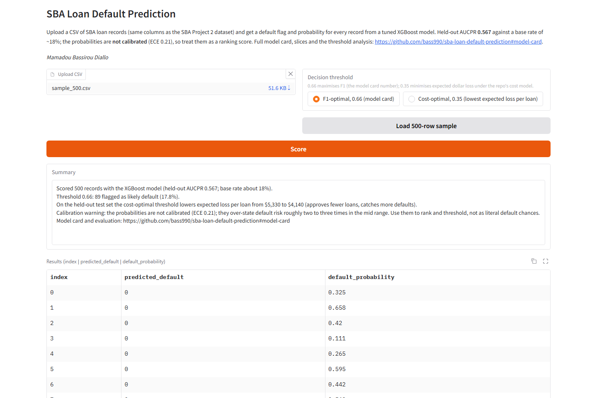
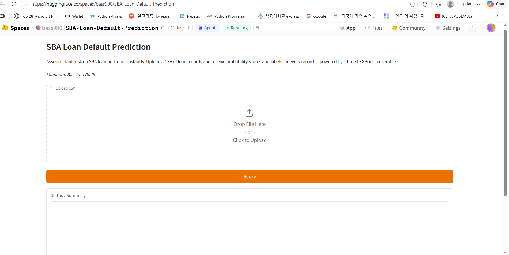
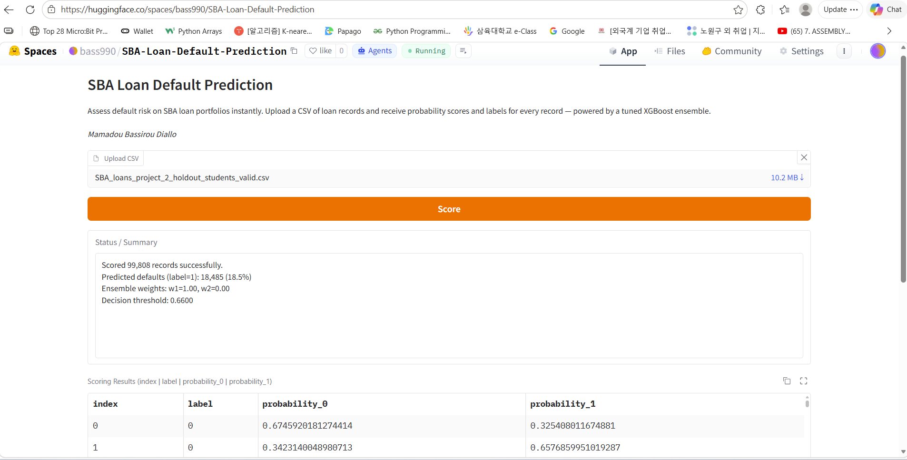

# Hugging Face Spaces Deployment

**Author:** Mamadou Bassirou Diallo 
**App type:** Gradio  

## Deployed App Link

 
> App link: `https://huggingface.co/spaces/bass990/SBA-Loan-Default-Prediction`

## How to Deploy

1. Create a new Space at https://huggingface.co/spaces (choose **Gradio** SDK).
2. Upload the following files to the Space repository:
   - `app.py` (this directory)
   - `score_model.py` (repo root; the Space imports it so scoring cannot drift from the API)
   - `sample_500.csv` (this directory; the "Load 500-row sample" button)
   - `artifacts/eval_report.json` (threshold + calibration numbers shown in the UI)
   - `requirements.txt` (this directory)
   - `artifacts/xgb_model_1.json`
   - `artifacts/xgb_model_2.json`
   - `artifacts/label_encoders.pkl`
   - `artifacts/median_fill.pkl`
   - `artifacts/ensemble_metadata.json`
3. The Space will install dependencies from `requirements.txt` and launch `app.py`.

## App Interface

The app provides:
- A CSV file uploader
- A threshold choice: F1-optimal 0.66 (model card) or cost-optimal 0.35 (lowest expected loss)
- A **Score** button and a **Load 500-row sample** button
- A summary panel: records scored, flagged share, the expected-loss comparison and a calibration warning
- A results table with columns: `index`, `predicted_default`, `default_probability` (3 dp)
- A **Download Results CSV** button

## Screenshots

*The v2 app as the Space serves it, captured 2026-09-30 from the Docker image at `/ui`, which runs the same `app.py`.*

The two older screenshots below are from the v1 app (single threshold, four-column output), kept for the record.

## Scoring Output Schema

| Column | Type | Description |
|--------|------|-------------|
| `index` | int | Original record ID from input |
| `label` | int (0/1) | Predicted class using ensemble F1 threshold |
| `probability_0` | float | Ensemble probability for class 0 (non-default) |
| `probability_1` | float | Ensemble probability for class 1 (default) |
